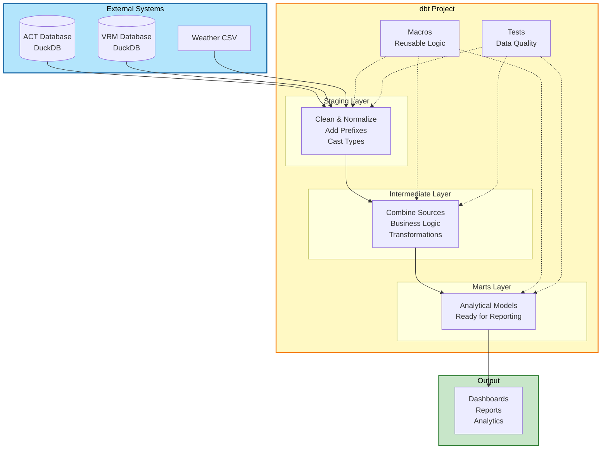

# Zoo Analytics - dbt Exercise Repository

Learn dbt through hands-on practice: managing multiple sources, modularizing SQL, and automating tests/macros.

## Case: Zoo Management Analytics

You're a data analyst at **Wildlife Wonders Zoo**. You need to build analytics dashboards using data from:

- **ACT (Animal Care Tool)** - DuckDB database with animal records, species, enclosures, feeding schedules
- **VRM (Visitor Relationship Management)** - DuckDB database with visitor data, tickets, events
- **Weather data** - CSV file with daily weather information

## Repository Structure

```
pxl-guest-lecture-dbt/
├── models/
│   └── zoo/              
│       ├── 1_staging/       
│       │   ├── act/           
│       │   ├── vrm/         
│       │   └── seeds/        
│       ├── 2_intermediate/     
│       └── 3_marts/            
├── macros/                 
├── tests/                     
├── seeds/                      
├── documentation/              
│   ├── hands_on_session_1.md   
│   └── business_queries/      
├── setup/                     
│   ├── setup_databases.py      
│   ├── init_duckdb.py         
│   └── README.md               
└── dbt_project.yml             
```

## Architecture Overview



## Quick Start

### Prerequisites

- Python 3.8 or higher
- pip (Python package manager)

And some Extensions for VSCode:
- RainbowCSV
- Markdown Preview Mermaid
- Better Jinja

### Setup Steps

**Step 0: Create Python virtual environment**
```bash
python3 -m venv .dbt-venv
source .dbt-venv/bin/activate
```
Make sure to set this as your default interpreter in VSCode.

**Step 1: Install dependencies**
```bash
pip install -r requirements.txt
```

**Step 2: Create databases and setup**
```bash
bash duckdb-setup/setup.sh
```
This creates:
- ACT and VRM DuckDB databases with sample data
- Main DuckDB database with attached sources
- Results directory for CSV exports

Then run the following command:
```bash
dbt seed
```

This reads the `weather_data.csv` seed and makes it structurally referrable in dbt.

**Step 3: Verify setup**
```bash
dbt debug
```
All checks should pass.

**Step 4: Run your first model**
```bash
dbt run --select stg_act_species
```
This should work immediately (it's already complete).

**Step 5: View results**
```bash
ls results/  # CSV files exported automatically
```

Take your time to get a feeling what you're working with in this repository by viewing the results, looking at the models and documentation before diving into the exercises.

## Exercises

See `documentation/hands_on_session_1.md` for detailed step-by-step instructions.

**Exercise 1: Staging Models** - Normalize data from multiple sources (ACT, VRM, CSV)  
**Exercise 2: Intermediate Models** - Combine data using JOINs and macros  
**Exercise 3: Mart Models** - Create analytical models, write macros and tests

**Total Time: 40-120 minutes**

## Cleanup

To remove all work done in the course simply do:

```bash
rm -rf pxl-guest-lecture-dbt/
```