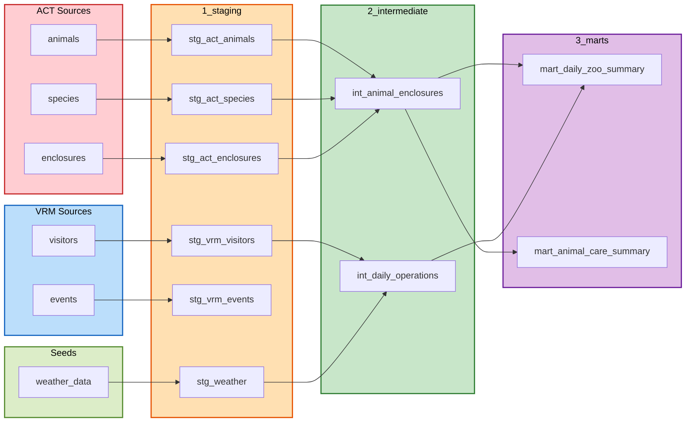

# Hands-On Session 1: Zoo Analytics with dbt

Overview of exercises for the Zoo Analytics dbt project.

## How to Use This Guide

1. Work through exercises in order (Exercise 1 → Exercise 2 → Exercise 3)
2. Open the model files to see TODO comments and what needs to be completed
3. Run `dbt run --select model_name` frequently to test your work
4. Check CSV files in `results/` to see your output

### Getting Help

- Complete examples: `stg_act_species`, `stg_weather`, `test_feeding_schedule_validity`
- Review YAML files next to each model (e.g., `stg_act_animals.yml`) for test patterns

## Model Dependencies



## Exercise 1: Staging Models

**Goal:** Normalize data from different sources (ACT, VRM, CSV).

**Why data cleaning in staging matters:**

Raw data from different systems is messy: inconsistent naming, different data types, missing values, and no standardization. If you try to work with raw data directly in your analytics, you'll spend time fixing the same issues over and over in every query.

Staging models solve this by cleaning data once, at the source. They:
- **Standardize naming** - Add prefixes (`act_`, `vrm_`) so columns from different systems don't conflict
- **Fix data types** - Cast dates, times, and numbers consistently so you can use them reliably
- **Handle missing data** - Decide how to treat NULLs early, not in every downstream query
- **Add metadata** - Include `source_system` so you always know where data came from

By doing this cleaning once in staging, every model that uses staging data gets clean, consistent inputs. You never have to worry about "is this date a string or a date?" or "which system did this column come from?" - it's already handled.

**What to do:**
- Open each staging model file and complete the TODO comments
- Add column prefixes (`act_`, `vrm_`), cast date/time columns, add `source_system`
- Review YAML files next to each model to understand tests

**Models to complete:**
- `stg_act_animals.sql` - Add source_system column
- `stg_vrm_visitors.sql` - Fix date/time casting, add source_system
- `stg_vrm_events.sql` - Fix date/time casting, add source_system

**Checkpoint:**
```bash
dbt run --select zoo.1_staging
dbt test --select zoo.1_staging
```

## Exercise 2: Intermediate Models

**Goal:** Combine data from different sources using JOINs.

**Why modularity and execution order matter:**

In traditional SQL, you'd write one massive query with all the JOINs, filters, and transformations mixed together. If you need the same combination of data in multiple places, you copy-paste that complex query - and when the logic changes, you update it in 10 different places.

dbt's modular approach fixes this:
- **Build once, use many times** - Create `int_animal_enclosures` that combines animals, enclosures, and species. Then any mart that needs this combination just references it with `{{ ref('int_animal_enclosures') }}`
- **Automatic execution order** - dbt reads your `{{ ref() }}` statements and automatically builds models in the right order. You don't need to think about dependencies - if `int_animal_enclosures` uses `stg_act_animals`, dbt builds `stg_act_animals` first
- **Easy to change** - Need to add a new column to the animal-enclosure combination? Update `int_animal_enclosures` once, and all marts that use it automatically get the new column
- **Clear separation of concerns** - Staging handles cleaning, intermediate handles combining, marts handle analytics. Each layer has a clear purpose

This modularity means you can build complex data pipelines from simple, reusable building blocks. Each model does one thing well, and you compose them together.

**What to do:**
- Open intermediate model files and complete JOINs
- Use `{{ ref('model_name') }}` to reference staging models
- Use the `normalize_species_name` macro

**Models to complete:**
- `int_animal_enclosures.sql` - Add JOINs to enclosures and species, use macro
- `int_daily_operations.sql` - JOIN weather data

**Checkpoint:**
```bash
dbt run --select zoo.2_intermediate
dbt test --select zoo.2_intermediate
```

## Exercise 3: Mart Models

**Goal:** Create final analytical models for reporting.

**Why marts fix the problems of messy SQL:**

First, look at `documentation/business_queries/` - these are real SQL scripts from a "business analyst" that show common problems:

**Problems with messy SQL:**
- **No version control** - Changes are made directly in the script with comments like "Fixed by John 2024-01-10". You can't see what changed, when, or why
- **One change breaks everything** - If a source table structure changes, you have to find and fix it in every query that uses that table. One small change can break 20 different reports
- **Everything mixed together** - Data cleaning, JOINs, aggregations, and business logic are all in one massive query. Hard to understand, hard to debug, hard to maintain
- **Copy-paste code** - Same logic repeated across multiple scripts. When the business rule changes, you update it in 10 places and hope you didn't miss one
- **No data quality checks** - Wrong data silently produces wrong results. No tests to catch problems before they reach reports

**How dbt fixes this:**
- **Version control built-in** - Every model is a file in Git. You can see exactly what changed, when, and why. Roll back if something breaks
- **Isolated changes** - If a source table changes, you fix it once in the staging model. All downstream models automatically get the fix. One change, everything updates
- **Separation of concerns** - Staging cleaned the data, intermediate combined it. Marts just do analytics: aggregations, calculations, business metrics. Simple and focused
- **Reusable building blocks** - Instead of copying SQL, you reference models with `{{ ref() }}`. Build once, use everywhere
- **Automatic testing** - Tests run every time you build. Catch data problems before they reach reports

Because we put effort into staging and intermediate models, marts are now simple: just aggregations and business logic. No data cleaning, no complex JOINs, no type casting - that's all handled upstream. The mart layer is where analytics should be: clean, focused, and easy to understand.

**What to do:**
- Complete mart models with aggregations and business logic
- Write the `calculate_visitor_capacity` macro
- Write a custom test for visitor spending consistency
- Review YAML files for mart tests

**Tasks:**
1. Review business queries to understand the problem
2. Complete `mart_daily_zoo_summary.sql` - Add aggregations, use macro
3. Write `calculate_visitor_capacity.sql` macro
4. Complete `mart_animal_care_summary.sql` - Fix grouping, use macro
5. Write `test_visitor_spending_consistency.sql` test

**Checkpoint:**
```bash
dbt run --select zoo.3_marts
dbt test --select zoo.3_marts
ls results/  # Check CSV exports
```

## Final Checkpoint

```bash
dbt run
dbt test
ls results/
```

## Key Takeaways

1. **Multiple Sources**: dbt handles different systems/formats in one project
2. **Modularization**: Layers (1_staging → 2_intermediate → 3_marts) make SQL reusable
3. **Automation**: Tests and macros save time and ensure quality
